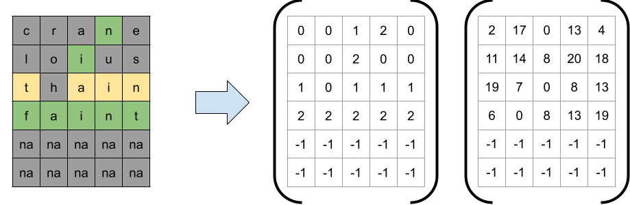
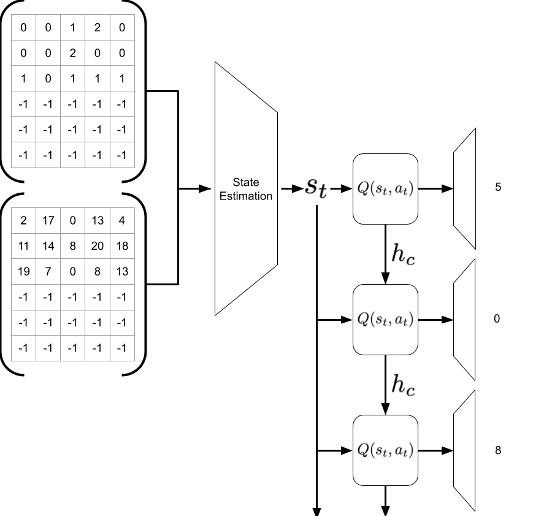

# Learning to Play Wordle w/ Reinforcement Learning

## Introduction

In [in their video on using Information Thoery](https://www.youtube.com/watch?v=v68zYyaEmEA), 3Blue1Brow approach the 
problem from a information theory, which is an appreciable approach. However, I believe that this isn't really how we 
people play this game, and I wondered if I could simulate that a little bit better. The following sections will likely 
be in the style of a stream of conciousness as I slowly think through each of the layers of problems and document them
as they come up or as I am writing some section of code and the thought occurs to me.

A lot of the content here will be more easily digestible and chronologically documented on [my personal blog](httpsL//vardulov.github.io/posts/2022/02/wordle-rl-part1)

## Getting Started

While there is a ton of different approaches to solving this problem we need to lay out the ground rules of our environment, 
and how our agent can interact with it. For example a decision that needs to be made is what is the defined action space, 
or rather, at what level does the agent interact with the environment. In more domain specific language, does our agent
have access to the vocabulary that is pre-defined by the list of words? I feel this scenario is a little too trivial
(and maybe I will still explore it as a means of evaluating my actual approach). Instead I think the prospect would be much
more interesting to explore individual character actions. 

From this decision 2 things must follow:
1. Our action space is define by a 27-dimensional distributional space. This is instead of the absurdly large action space
   describe by trying to guess the whole word.
2. Our agent is predicting a sequence rather than a single output, which adds the necessity for considering previous letters
   already chosen while considering the next letter.
   
That second point brings up further another question about how we're going to model the output:
1. Is the output going to be modelled as single $$27 \times 5$$ dense output?
2. Or should the ourput be a 5-step $$27 x 1$$ recurrent output?

We're already going to assume that this is going to require some sort of neural based model... mostly because I decided. 
But regardless the question remains, and we'll probably try a little bit of both. I'm partial to the recurrent version, 
there might be some difficulty with convergence.

The next question that needs to be addressed is what information will the agent have access to.
This seema a little more straight forward, they should have access to the game state. More concretely, the past guess up
to this point and the feedback we've recieved from the environment.

The following image relays the way I plan on representing the date to the system as two $6 \times 5$ matrices that 
capture the letters used with integers and the feedback that the system is given for each guess along the way

Next an outline of how I plan on organizing the model that will be used to learn the $Q$-function that will be used to 
make character-to-character predictions:

## Glossary of Terms

* Agent - the executor of actions, sensor of the environment, and the reciever of rewards
* Environment - the defined space that can probe with sensors and act upon
* 